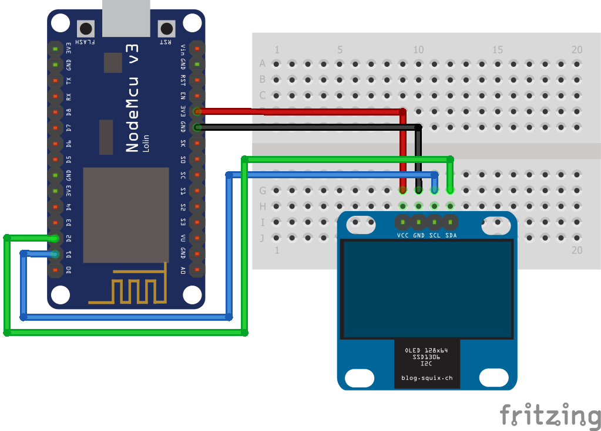

# Estação Meteorológica com a placa NodeMCU e a API do OpenWeatherMap

Este repositório contém o código e esquemática para a contrução de uma estação meteorológica com a placa [NodeMCU](https://www.nodemcu.com/index_en.html) e a API do [OpenWeatherMap](https://openweathermap.org/).

## Funcionamento

Esta estação meteorológica funciona através da obtenção de dados da API do OpenWeatherMap (temperatura, estado do tempo e previsão dos próximos 3 dias). Também mostra a hora e data atual.

Os dados são mostrados de forma alternada, estando divididos em 3 ecrãs:
- **data e hora**
- **temperatura e estado do tempo atual**
- **previsão para os próximos 3 dias**

## Esquemática

## Montagem

A montagem do projeto encontra-se dividida em 3 partes:

- **Materiais Necessários**: lista dos materiais necessários, dividos por categorias (Hardware, Software, etc)
- **Passos**: passos para a montagem do projeto
- **Configurações**: passos adicionais necessários para o correto funcionamento do projeto

Estes passos devem ser seguidos pela ordem estipulada para a correta montagem e funcionamento do projeto final.

### Materiais Necessários

Abaixo estão todos os materiais necessários, divididos por categorias, para a realização deste projeto.

#### Hardware

- Placa NodeMCU v3 ou compatível
- OLED 0.96"
- Jumper Wires

#### Software

- Conta e chave de API no OpenWeatherMap, pode ser obtida [aqui](https://openweathermap.org/api)
- Visual Studio Code (com [PlatformIO](https://platformio.org/)) ou IDE do Arduino

#### Bibliotecas

As seguintes bibliotecas foram utilizadas no projeto e devem ser instaladas:

- [WeatherStation](https://platformio.org/lib/show/563/WeatherStation)
- [SSD1306](https://platformio.org/lib/show/135/Adafruit%20SSD1306)
- [JsonStreamingParser](https://platformio.org/lib/show/561/JsonStreamingParser)

### Passos

1. Montar o circuito de acordo com a [esquemática](#Esquemática)

2. Abrir o Visual Studio Code ou o IDE do Arduino

3. Instalar as [bibliotecas necessárias](#Bibliotecas), seguindo as instruções para o ambiente de desenvolvimento escolhido

4. Efetuar as seguintes alterações no ficheiro `include/config.h`:

    - **`WIFI_SSID`**: nome da rede WiFi

    - **`WIFI_PASS`**: palavra-passe da rede WiFi
    
    - **`NTP_SERVER`**: servidor de hora da Internet. **Alterar caso o fuso horário seja diferente!**

    - **`OPEN_WEATHER_MAP_APP_ID`**: chave API do OpenWeatherMap
    
    - **`OPEN_WEATHER_MAP_LOCATION_ID`**: código da cidade para a qual querem receber informações (pode ser obtida através [deste link](https://openweathermap.org/find))
    
    - **`IS_METRIC`**: utilizar as medidas Métricas ou Imperiais
    
    - **`UPDATE_INTERVAL_SECS`**: intervalo de atualização dos dados (ter em atenção o limite da API do OpenWeatherMap)
    
    - **`OPEN_WEATHER_MAP_LANGUAGE`**: idioma das informações
    
    - **`WDAY_NAMES`** e **`MONTH_NAMES`**: podem ser alterados caso pretenda traduzir o projeto para outras línguas

5. Fazer *upload* do código para a placa e verificar o resultado

## Notas

Projeto baseado no original em [ThingPulse](https://github.com/ThingPulse/esp8266-weather-station).

## Licença

[MIT](LICENSE)